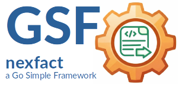

<sup>🌍 **Sprache:** 🇬🇧 [Englisch →](README.md)</sub>

---
|[](./LICENSE)| |
|----|----|
|| ***GSF-NexFact***<br>ein modulares System zur Erzeugung rechtssicherer elektronischer Rechnungen (ZUGFeRD/Factur-X). Es verbindet die Flexibilität von Go mit der Layout-Macht von LibreOffice und der Standard-Konformität des Mustang-Projekts.|

<sup>***GSF*** steht für ***Go Small Frameworks*** — minimalistische Tools für robuste Applicationen.</sup>

---

### Repository

Das Projekt wird auf Codeberg entwickelt und gewartet.

**Canonical repository:**

> https://codeberg.org/tiny-frameworks/nexfact

GitHub ist ein automatisierter Mirror des Codeberg Repositories

**GitHub mirror:**

> https://github.com/tiny-frameworks/nexfact

---

## GSF-NexFact

**GSF-NexFact** ist ein **modulares System** zur flexiblen Generierung, Analyse und Validierung
von **ZUGFeRD- und Factur-X-E-Rechnungen** aus JSON-Daten. Es transformiert Eingaben
in **XML, Standard-PDFs oder hybride ZUGFeRD-Rechnungen** (inkl. Anhängen) und
nutzt dabei eine **dateibasierte Architektur** mit klaren Konventionen.

---

## Architektur & Kernprinzip: Convention over Configuration

Das Gesamtsystem basiert auf einem strikt dateibasierten Datenaustausch über eine definierte
Verzeichnisstruktur (`NEXFACT-env`). Der Go-Orchestrator steuert die Zustände, während
spezialisierte Worker (Native oder in isolierten Containern) die Verzeichnisse überwachen
und verarbeiten. Die Klammer zwischen Go, dem LibreOffice-Basic-Makro und der Mustang-Engine
(Java) bildet eine standardisierte `RenderJob`-Datei.

```
                +-----------------------+
                |  nexfact-orchestrator |
                +-----------+-----------+
                            | (übernimmt die Orchestrierung, transformiert
                            |  input-json in interne MasterZugFerd-Struct)
                            v
                +-----------------------+
                |      nexfact-env      | <--- Gemeinsamer Zustand (Directories)
                +-----------+-----------+
                            |
           +----------------+-------------+
           v                              v
+------------------------+     +-----------------------+
|  PDF mit LibreOffice   |     |  ZUGFeRD mit Mustang  |
| native oder Container  |     | native oder Container | (Worker)
+------------------------+     +-----------------------+
```

---

## Repository-Übersicht, Komponenten (Module), Dokumentation

Dieses Repository ist als Multi-Modul-Repository organisiert:

- [`api`](./api/README.md): Kern-Schnittstellen, Types, Structs, Functions, zentrales Fehlerhandling. z.B.: `RenderJob`, `Error`, `Writer`
- [`engines`](./engines/README.md): Verarbeitungs-Engines (`writer`), Synchronisation & Steuerung der Worker
- [`orchestrator`](./orchestrator/README.md): Steuerungseinheit, Einstiegspunkt
- [`examples`](./examples/main.go): Direkt lauffähige Code-Beispiel.
- [`env`](./env/README.md): Verzeichnisstruktur & Konfigurationen
- [`deployments`](./deployments/README.md): Container-Repos für Docker/Podman (PDF/Mustang)


Hilfsmodule

- [`cache`](https://codeberg.org/tiny-frameworks/nexutils/cache): Minimalistisches Caching-Modul
- [`logger`](https://codeberg.org/tiny-frameworks/nexutils/logger): MultiLogger (Console/File) auf Basis `log/slog`

---

## Quick Start & Integration (Go API)

Ein einfaches `main.go` - Snippet als Einstiegspunkt. Es werden hier Defaultwerte verwendet.

Dies sind:
- Die `env` - Struktur befindet sich auf neben der main.go im working-Directory.
- Es wird der `default` - Seller verwendet. Zu finden in `env/sellers/default`.
- Als Provider wird `native` verwendet. Zu sehen in `env/system/systm.yaml` (`zugferd_provider=native` und `pdf_provider=native`)

Das dokumentierte und lauffähige Beispiel findest unter [examples](./examples/main.go) 
Das containerized Pendant zu diesem main.go findest unter [deployments](./deployments.README.md) 
Eine ausführliche und komplexe Vorlage, findest du im [orchestrator](./orchestrator/orchestrator_suite_test.go). 

```go
package main

import (
	// standard imports"
	// nexfact imports"
)

func main() {

	// Required only for the local monorepo example:
	os.Setenv(orchestrator.EnvRootKey, "../env")

	orch, err := orchestrator.NewDefault()
	if err != nil {
		nexerrors.LogError(logger.Logger, err)
		os.Exit(nexerrors.GetExitCode(err))
	}

	// 2. Execute job (expects JSON payload for the toolchain)
	jsonPayload := jsonJob()
	result, err := orch.RunJsonJob(jsonPayload)
	if err != nil {
		nexerrors.LogError(logger.Logger, err)
		os.Exit(nexerrors.GetExitCode(err))
	}

	logger.Logger.Info("Job succeeded", "JobID:", result.JobID, "OutputPath", result.OutputPath)
	if err := openPDF(result.OutputPath); err != nil {
		nexerrors.LogError(logger.Logger, err)
		os.Exit(nexerrors.GetExitCode(err))
	}
	os.Exit(0)
}

func openPDF(filePath string) error {
    // go-code to open the generated pdf-file	
    // see: examples/main.go
}

func jsonJob() []byte {
    // bytestream for a minimal sample zugferd-invoice
    // see: examples/main.go
}

```

---

## Organisation & Standards

* **Copyright:** © 2026 Georg Hagn.
* **Repository:** `codeberg.org/tiny-frameworks/nexfact`
* **Lizenz:** Apache License, Version 2.0.

*GSF-NexFact ist ein unabhängiges Open-Source-Projekt und steht in keiner Verbindung zu Unternehmen mit ähnlichem Namen.*

---

## Kontakt & Support

Für Anfragen, architektonische Diskussionen oder Sicherheitsfragen wende dich bitte an:

📧 **georghagn [at] tiny-frameworks.io**

---

